# AR Late Payment Analysis

Built an end-to-end finance analytics solution in Microsoft Fabric, processing 2,000+ invoice records through a Fabric pipeline to identify which customers have consistently been a payment risk and how much money is currently at stake.

---

## Short Description

**AR Late Payment Analysis** is an analytical report designed to help Rakesh, from the Finance department, understand why the company's Days Sales Outstanding (DSO) has been creeping up over the last few quarters — cash that should be in the company's account has been sitting with customers longer than it should. This dashboard identifies which customers have consistently been a problem, how late they typically pay, and how much money is at risk. It's built for data analysts, the finance department, management, and anyone who needs to understand DSO trends and act on them.

---

## Tech Stack

- **Microsoft Fabric Pipeline** – Ingested 2,000+ customer records from an online dataset and applied transformations using a notebook.
- **Microsoft PySpark Notebook** – Handled data transformation, cleaning, and feature engineering.
- **Microsoft Lakehouse** – Primary data source, storing structured Delta tables.
- **Microsoft Fabric Semantic Model** – Built the data model and defined relationships.
- **DAX (Data Analysis Expressions)** – Used for calculated measures, dynamic visuals, and conditional logic.
- **Power BI Desktop** – Main platform used for report creation.
- **OneLake Security** – Implemented column-level and row-level security to protect sensitive data.
- **App** – Published as `App_late_payments` for end-user access.
- **File Formats** – `.pbix` for development, `.png` for dashboard previews.

---

## Data Source

- **Source:** Finance Factoring – IBM Late Payment Histories
- **Link:** [Kaggle Dataset](https://www.kaggle.com/datasets/hhenry/finance-factoring-ibm-late-payment-histories)

The dataset covers 2,000+ customer invoice records for 2012–2013, including invoice date, invoice amount, paperless billing status, due date, days late, and days to settle.

---

## Workflow

The end-to-end pipeline was built entirely within Microsoft Fabric:

- **Workspace** – Created `ws_finance` to host all Fabric items for this project.
- **Notebook** – Built a PySpark notebook following medallion architecture:
  - **Bronze** – Raw invoice data ingested; checked data types, null values, and row/column counts.
  - **Silver** – Cleaned, correctly typed, and deduplicated data.
  - **Gold** – Aggregated and enriched with aging buckets, invoice amount buckets, and customer-level summaries for reporting.
- **Lakehouse** – Loaded all three layers into `lh_finance` as structured Delta tables, with Bronze, Silver, and Gold sitting inside the same lakehouse.
- **Security** – Applied column-level security (hiding `InvoiceAmount`) and row-level security (filtering by `countryCode`) directly on `lh_finance` using OneLake security, ensuring protection is enforced consistently across every engine that queries the data, not just the report.
- **Semantic Model** – Built `Finance_Model`, which automatically inherits the OneLake security rules with no separate configuration needed.
- **Report** – Created the **AR Late Payment Analysis** report in Power BI, with separate pages for **Payment Performance** (drivers of late payments) and **Collections Risk** (who's chronically late and carries the most money at risk).
- **App** – Published `App_late_payments` for end-user access.

---

## Feature Highlights

### Business Problem

I used AI as a stakeholder simulation, roleplaying as Rakesh from the Finance department. The company sells on credit to distributors and business clients under standard 30/45/60-day payment terms. Over the last few quarters, the company's DSO had been creeping up — cash that should be in the company's account was sitting with customers longer than it should.

**Key Questions:**
- "Which customers have consistently been a problem over the last two years — not just once, but repeatedly?"
- "Is there a pattern in why people pay late — paper vs. electronic billing, disputes, or just general behavior?"
- "Has this gotten better or worse over time?"
- "When customers are late, how late are they, typically?"
- "For customers we flag as 'risky' — how much money are we actually talking about?"

### Goal of the Dashboard

The goal of this dashboard was to build an interactive report that helps the Finance department understand the root causes of payment delays relative to the standard 30/45/60-day payment terms. It helps Rakesh communicate to leadership and senior management what steps can be taken to reduce and manage DSO by identifying its key drivers.

### Key Visuals

**KPIs used in this report:**

- **Money at Risk:** $53.96K — total invoice value currently tied to customers who have paid late
- **Late Customers:** 83 — number of customers who have paid at least one invoice late
- **Late Customer Rate:** 35.56% — share of all invoices that were paid late
- **30+ Day Customers:** 5 — customers currently running 30+ days late on payment
- **Avg Days Late:** 10 — average number of days a payment arrives past its due date
- **Money at Risk — 30+ Days Late:** $561.52 — total invoice value tied to the most severely late customers
- **Repeat Late Customer:** 34 — customers with a consistent pattern of late payment, not a one-off, defined as paying more than 50% of their invoices late and having more than 3 late invoices

**Slicers used:**
- Year (invoice year)
- Month (invoice month)
- Country Code

**Total Invoices and Customer % Late Trend Over Time:**
A line-and-column combo chart where columns represent total invoices per month and the line represents late-invoice % — showing how the proportion of late invoices has changed over time.

**Customer % Late by Disputed Bills:**
A bar chart showing whether disputed bills drive late payment issues.

**Severe Risk — 30+ Days Late:**
A matrix of customers who paid after 30+ days, showing whether the amount owed is significant — helping Treasury plan further in advance.

**Top 20 Customers — Collections Priority:**
A matrix of the customers with the highest money at risk, along with late invoice %, late invoice count, and average days late.

**Customer % Late by Type of Bill:**
A bar chart showing whether paper or electronic bills are more likely to be late, helping guide a shift toward the billing method that causes fewer late payments.

---

## Insights

- Money at risk — the total amount tied to late-paying customers — is $53.96K.
- DSO, or late customer %, has improved by 3.5% year over year.
- The top 20 customers with the highest money at risk should be contacted first.
- Some customers who pay after 30 days also carry high invoice amounts and should be watched closely.
- Disputed bills tend to have more late payments.
- Paper bills tend to generate more late payments than electronic bills.
- Invoices in the larger amount band receive the most late payments.
- There are 34 repeat late customers who pay more than 50% of their invoices late and have more than 3 late invoices.
- Money tied to 30+ day late customers totals $561.52, across just 5 customers.
- Customers with a higher late-invoice frequency also tend to carry higher financial exposure, as seen in the relationship between late-payment rate and money at risk on the Collections Risk page.

---

## Business Impact

- Treasury planning should account for the $53.96K currently at risk.
- DSO is improving year over year but still needs further improvement.
- Collections teams should prioritize the top 20 late-paying customers to support treasury planning.
- Customers with average days late greater than 30 and high invoice amounts need strict follow-up action.
- Repeat late customers should be contacted more frequently and kept under close watch.
- Customers should be encouraged to shift toward electronic billing.
- Customers with large invoice amounts should be checked more frequently to track payment status.

---

## Screenshots

**Workspace (ws_finance)**
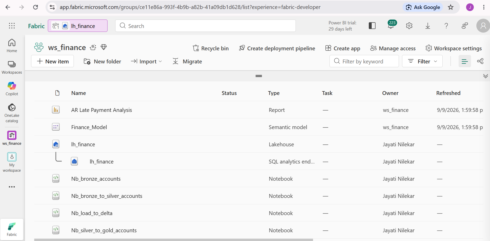

**Data ingesting through pipeline (pl_ingest_finance)**
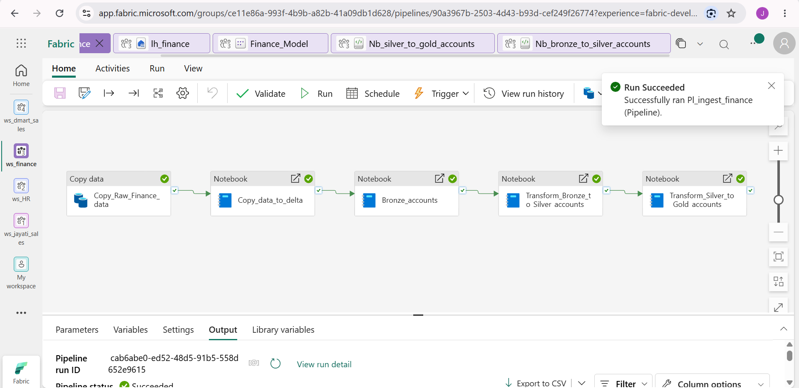

**Data loading to Lakehouse (lh_finance)**
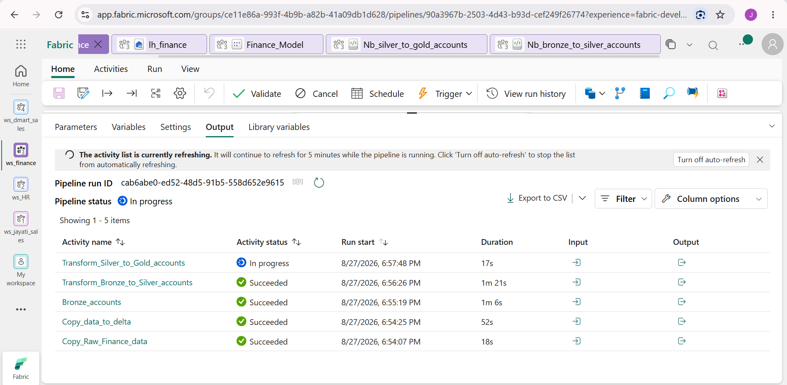

**Data in Lakehouse (lh_finance)**
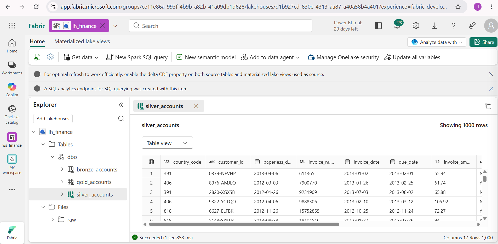

**Semantic Model (Finance_Model)**
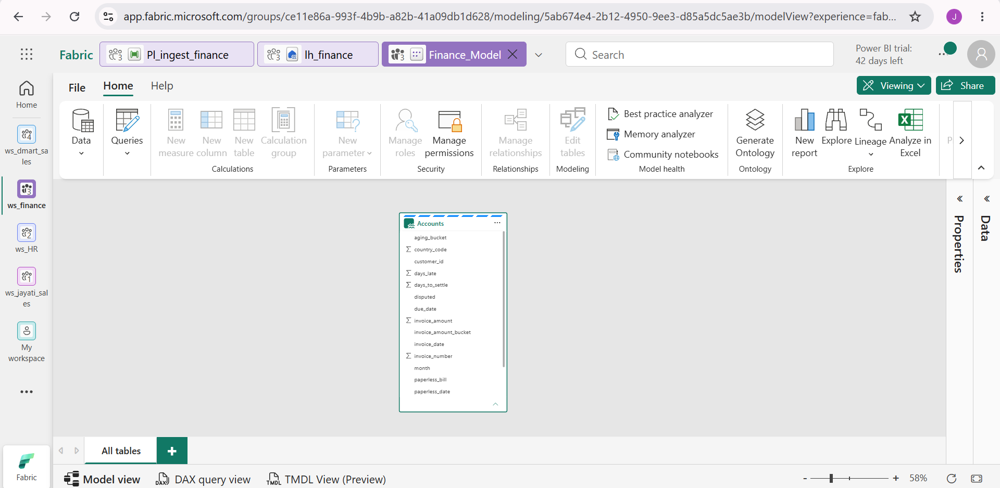

**Payment Performance of Dashboard**
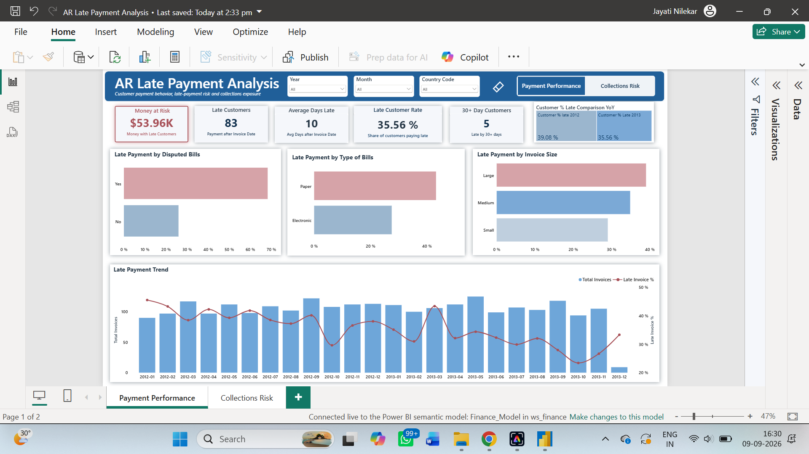

**Collection Risk of Dashboard**
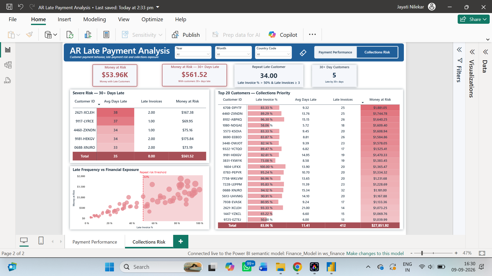

**Implementing Row-Level Security**
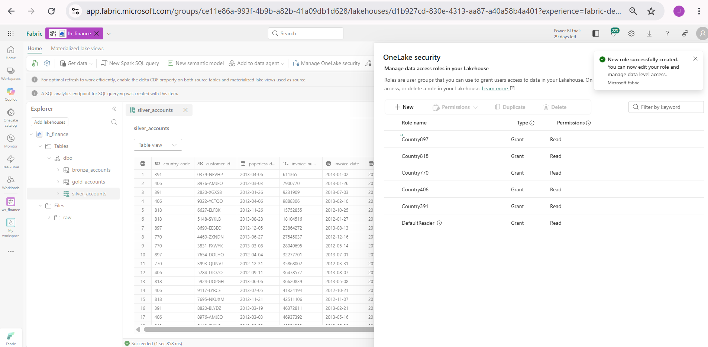

**Row-Level Security Applied**
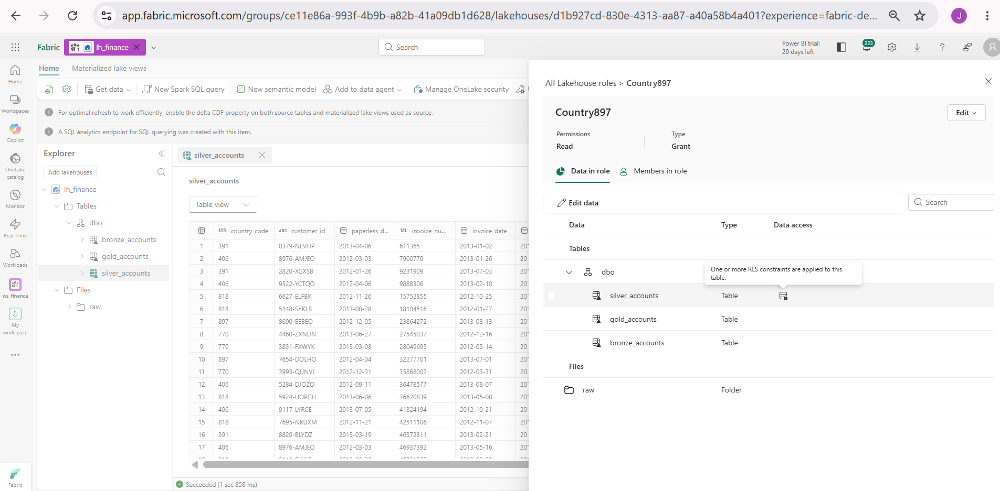

**Column-Level Security Applied**
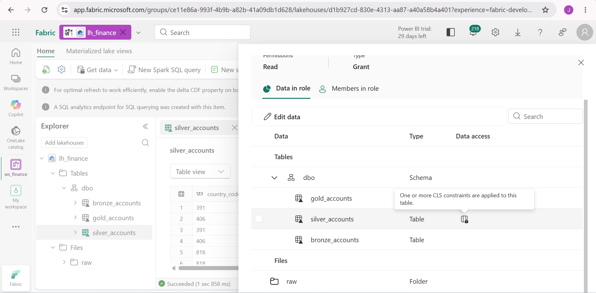

**App (App_late_payments)**
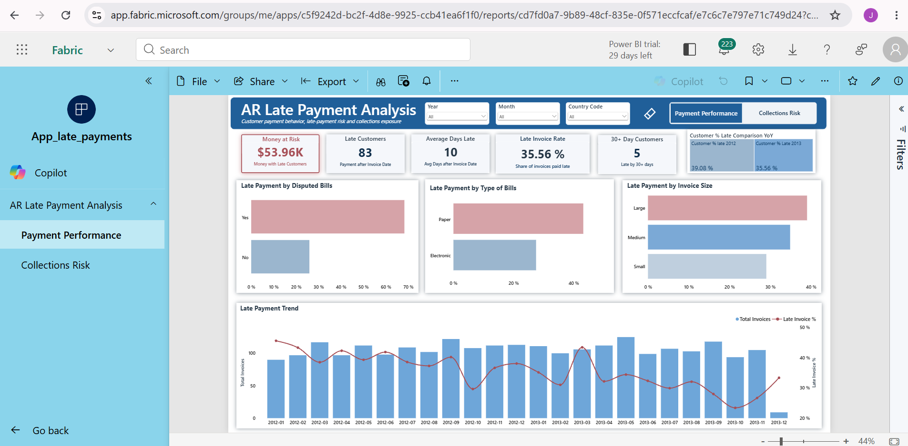
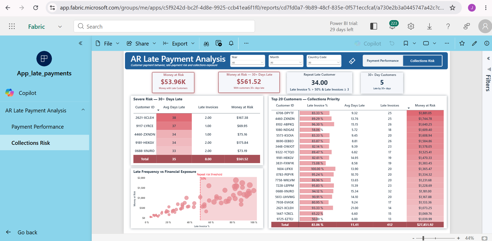
